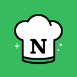

# Notion AI Recipe Importer

A Chrome extension that extracts recipes from any website with one click and imports them directly into your Notion database using Claude AI.



## Features

- **One-Click Recipe Import**: Extract and save recipes to Notion with a single click
- **Smart Extraction**: Uses Claude AI to accurately extract recipe details from any website
- **Structured Notion Pages**: Creates well-formatted Notion pages with ingredients, directions, images, and more
- **Background Processing**: Continues working even when the popup is closed
- **Desktop Notifications**: Get notified when imports complete, fail, or are canceled

## How It Works

1. Visit a recipe website you want to save
2. Click the extension icon in your browser
3. The extension extracts the recipe using Claude AI
4. A new page is created in your Notion database with all recipe details
5. Receive a desktop notification when the import is complete

## Installation

### From Chrome Web Store
*(Coming soon)*

### Manual Installation
1. Download this repository as a ZIP file and extract it
2. Open Chrome and go to `chrome://extensions/`
3. Enable "Developer mode" in the top right
4. Click "Load unpacked" and select the extracted folder
5. The extension is now installed

## Setup

Before using the extension, you need to configure:

1. **Claude API Key**: Get an API key from [Anthropic](https://www.anthropic.com/)
2. **Notion Integration Token**: Create an integration at [Notion Developers](https://www.notion.so/my-integrations)
3. **Notion Database ID**: Copy the ID from your recipes database URL

To configure:
1. Click the extension icon and select "Options"
2. Enter your credentials
3. Click "Save"

## Notion Database Requirements

Your Notion database should have:
- A title property for the recipe name
- A multi-select property for cuisine categories
- Optionally, a URL property for the source

## Privacy & Security

- Your API keys are stored securely in Chrome's sync storage
- Keys sync across your devices where you're signed into Chrome
- No data is sent to our servers - all processing happens between your browser, Claude AI, and Notion
- All communications use secure HTTPS connections

## Limitations

- The extension requires an active internet connection
- Claude AI and Notion API usage may incur costs based on your subscription
- Images are imported via URL reference (not downloaded and uploaded to Notion)

## Troubleshooting

Common issues:
- **API Key Invalid**: Ensure your Claude and Notion API keys are correctly entered
- **Import Failed**: Try refreshing the page or check if the site blocks content scraping
- **Processing Stuck**: Use the cancel button and try again
- **Missing Permissions**: Make sure you've shared your Notion database with your integration

## Development

### Project Structure
```
notion-ai-recipe-importer/
├── css/             # Stylesheets
├── images/          # Extension icons
├── js/              # JavaScript files
│   ├── background.js # Background service worker
│   ├── content.js    # Content script
│   ├── options.js    # Options page logic
│   └── popup.js      # Popup UI logic
├── manifest.json    # Extension manifest
├── options.html     # Options page
└── popup.html       # Popup UI
```

### Building from Source
1. Clone the repository
2. Make any desired changes
3. Follow the manual installation steps above to test

## Contributing

Contributions are welcome! Please feel free to submit a Pull Request.

1. Fork the repository
2. Create your feature branch (`git checkout -b feature/amazing-feature`)
3. Commit your changes (`git commit -m 'Add some amazing feature'`)
4. Push to the branch (`git push origin feature/amazing-feature`)
5. Open a Pull Request

## License

This project is licensed under the MIT License - see the LICENSE file for details.

## Future Ideas

We're considering several enhancements for future versions:

- **Mobile-Friendly Solution**: Develop a mobile app or progressive web app to capture recipes on mobile devices
- **Video Recipe Support**: Add support for extracting recipes from YouTube cooking videos and Instagram Reels/Stories
- **Offline Mode**: Allow saving recipes locally when offline and syncing to Notion later
- **Custom Templates**: Let users define their own Notion page templates for imported recipes
- **Batch Import**: Support importing multiple recipes at once from bookmark collections

We welcome suggestions and contributions to help implement these features!

## Acknowledgements

- [Anthropic's Claude AI](https://www.anthropic.com/) for powering the recipe extraction
- [Notion API](https://developers.notion.com/) for the database integration
- All the amazing recipe websites that make their content available